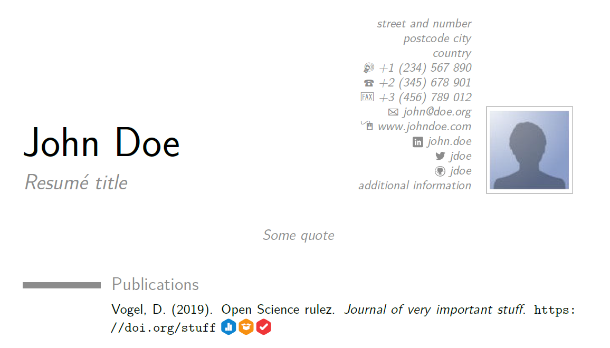

# Open Science Badges for a CV in LaTeX (using moderncv)

Example of how to include open science badges in your CV in LaTeX. The example uses the [```moderncv```](https://ctan.org/pkg/moderncv) package by Xavier Danaux (xdanaux@gmail.com) and is based on Danaux's [example file](https://bazaar.launchpad.net/~xdanaux/moderncv/trunk/files/head:/examples/). The code for including the open science badges was adapted from Amanda Montoya's [OpenScienceBadgeCV](https://github.com/akmontoya/OpenScienceBadgeCV) example. The badges have been downloaded from the [Center for Open Science](https://osf.io/tvyxz/files/).



# Code

The main code is added in lines 57-65 in ```cv_example.tex```:

```latex
\newcommand*{\badge}[1]{%
	\raisebox{-.2\baselineskip}{%
		\includegraphics[
		height=1\baselineskip,
		%width=\baselineskip,
		keepaspectratio,
		]{#1}%
	}%
}
```

To add an open science badge use the following code:

```latex
\href{https://osf.io/djrtp/}{\badge{opendata.pdf}}
```

The following badges are available:

* Open data: ``opendata.pdf``
* Open materials: ``openmaterials.pdf``
* Preregistration: ``preregistered.pdf``